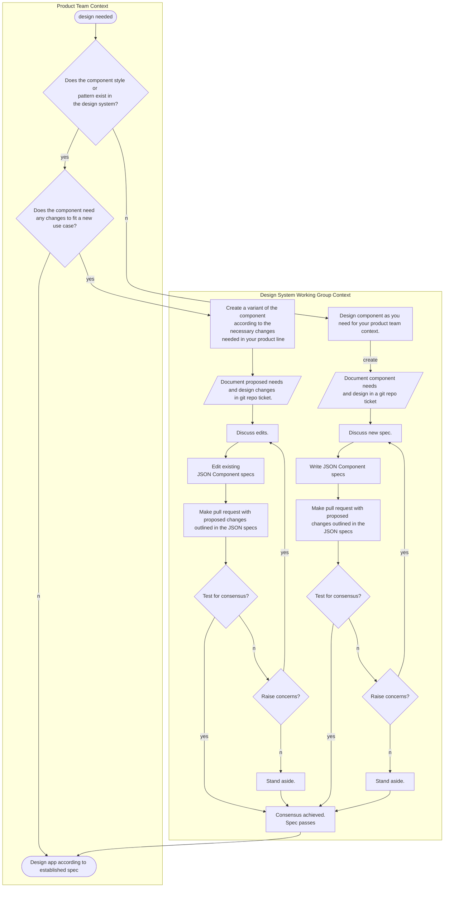

# DesignOps HackPack

Template repo for bootstrapping a desOps practice using github.

## Design Tokens

Design tokens are standardized design elements that can be shared and reused across an organization's design system to provide consistent representation of design elements like color, typography, and spacing. Design tokens enable designers and developers to work with a consistent set of design elements, ensuring the design of a product is cohesive and consistent, and making it easier to update and maintain the design. They are a crucial part of a design system as they provide a shared language and guidelines for designers and developers to follow when creating user interfaces.

> If Components are the [atoms](https://bradfrost.com/blog/post/atomic-web-design/) of a design system, then design tokens are the sub-atomic particles.

*(borrowed from [this article](https://specifyapp.com/blog/introduction-to-design-tokens))*

The essential structure is:

Product > Features > Interfaces > Components > Design Tokens

`Products` are composed of `Features`, `Features` are composed of `Interfaces`,`Interfaces` are composed of `Components`, `Components` are composed of `Design Tokens`.

Every value of every key-value pair in the JSON specs is a design token.

Recommended reading for design systems:

- [What are Design Tokens by CSS Tricks](https://css-tricks.com/what-are-design-tokens/)
- [What are Design Tokens by Specify App](https://specifyapp.com/blog/introduction-to-design-tokens)
- [Adobe's Design Token Page](https://spectrum.adobe.com/page/design-tokens/)

## Palettes

Palettes are collections of design token values that are used globally. The 4 palettes included in this repo as examples are:

### [Color](./component-specs/color-palette.json)

Probably the most well known sort of palette, this is how semantic UI, branding, dark mode alts, and theme colors are defined.

### [Type](./component-specs/type-palette.json)

Another common palette is the Type palette, which defines the semantic hierarchy expressed through type family, sizing, and weight.

### [Icon](./component-specs/icon-palette.json)

Defines the semantic hierarchy of iconography. Icons are stored as SVGs in the asset folder, and are referenced by the palette. You can use this git repo as a direct dependency for code that uses these SVGs.

### [Shape](./component-specs/icon-palette.json)

Shape covers general tokens like border radius, and layout stuff like margin and padding.

## Design System Governance
The Design System Governance is centered on the Product Team context in order to ground the work in the particular needs of the applications as they exist and are built. The purpose of this is to encourage an agile, iterative, collaborative, bottom-up organization of Design System standards rather than a slow top-down organization which attempts to force standards onto Product Teams that may not even need them.

The Design System Governance work can be aided by the [Github issue templates](https://docs.github.com/en/communities/using-templates-to-encourage-useful-issues-and-pull-requests/about-issue-and-pull-request-templates) found in this repo.

### Bar for Consensus

You can adopt your own system for defining how a spec passes but for the sake of simplicity this repo assumes that a [consensus](https://en.wikipedia.org/wiki/Consensus_decision-making) method is used.

## Design Systems are not Component Libraries or UI Kits

Something important to understand is that a Design System is bigger than a single implementation.

*(borrowed from [this article](https://specifyapp.com/blog/introduction-to-design-tokens))*

Design Systems are bigger than just the code libraries or the Figma/Sketch/Penpot UI Kits that implement them. The Design System is the social construction that designers, devs, content creators, product, and stakeholders use to communicate and build consensus on how work gets done. This is why a solid designOps process requires a clear process for building that consensus.
